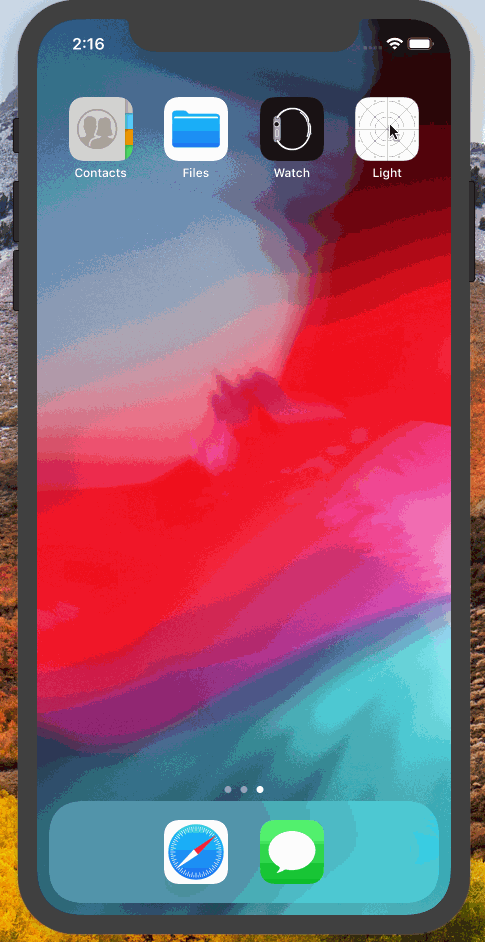

# Light

Light is a simulated flashlight app for iOS.

Submitted by: Joey Feazel

Time spent: 90 Minutes

## User Stories

The following **required** functionality is complete:

* [X ] User can tap a button to turn the flashlight on or off.

The following **additional** features are implemented:

*Created button as entire screen to improve the look as opposed to having a generic button in the middle of the screen
## Video Walkthrough 

Here's a walkthrough of implemented user stories:

## Notes

No issues besides xCode being buggy when attempting to reopen the project on different PC

## License

Copyright 2020 Joey Feazel 

Licensed under the Apache License, Version 2.0 (the "License");
you may not use this file except in compliance with the License.
You may obtain a copy of the License at

http://www.apache.org/licenses/LICENSE-2.0

Unless required by applicable law or agreed to in writing, software
distributed under the License is distributed on an "AS IS" BASIS,
WITHOUT WARRANTIES OR CONDITIONS OF ANY KIND, either express or implied.
See the License for the specific language governing permissions and
limitations under the License.
